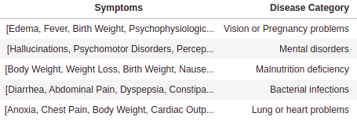

    

# Project Symptoms-Disease Network

## Overview

Analysis of the Symptoms-Disease Network database using communities.

## Approach

The steps developed in this project were as follows:

## Dataset

The dataset was extracted from the paper: "Human symptoms–disease network" [Link](https://www.nature.com/articles/ncomms5212).

More exactly, here we employ the "Supplementary Data 3": Term co-occurrences between symptoms and diseases measured by TF-IDF weighted values. This table includes 147,978 records of symptom and disease relationships. 

## All Networks: bipartite graph and their projections

## Communities of Diseases Network using Louvain

## Bipartite graphs of each community by symptoms and diseases 

## Table of the characterization of each community by symptoms

## Predict the disease category based on symptoms

## References

- Zhou, X., Menche, J., Barabási, AL. et al. Human symptoms–disease network. Nat Commun 5, 4212 (2014). [https://doi.org/10.1038/ncomms5212](https://doi.org/10.1038/ncomms5212)    

<!---

git pull
git add -A
git commit -m "updating readme"
git push -u origin main

--->

