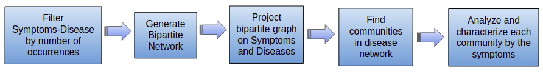

    

# Project Symptoms-Disease Network

## Overview

Analysis of the Symptoms-Disease Network database using communities.

## Approach

## All Networks

## Communities of Diseases Network

## Characterize each community by the symptoms

## Predict the disease category based on symptoms

## References

- Zhou, X., Menche, J., Barabási, AL. et al. Human symptoms–disease network. Nat Commun 5, 4212 (2014). [https://doi.org/10.1038/ncomms5212](https://doi.org/10.1038/ncomms5212)    
